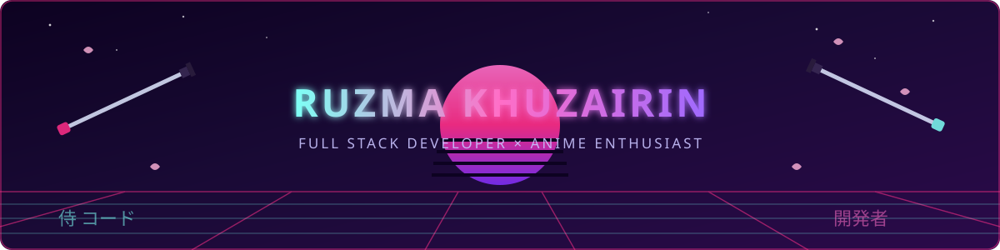

<div align="center">




</div>

<br>

## 👤 System.Info

```yaml
identity: zairin
class: Full Stack Developer
current_quest: Chatbot berbasis FastAPI + Knowledge Base Matching
learning_arc: Next.js & Node.js ecosystem
language: Bahasa Indonesia 🇮🇩
alignment: Neutral Good — ships clean code, watches anime after deploy
```

- 🔭 **Sedang digarap:** Chatbot cerdas pakai **FastAPI**, dengan sistem **Knowledge Base Matching** buat jawab pertanyaan jadwal dokter/spesialis
- 🌱 **Level up:** eksplorasi **Next.js** & **Node.js** buat sisi frontend
- ⚔️ **Weapon of choice:** Python, sambil sesekali nyemplung ke JavaScript
- 🎴 **Side quest:** anime marathon tiap malam minggu

<br>

## ⚔️ Tech Arsenal

<div align="center">


</div>

<br>

## 📊 Stats.exe

<div align="center">


</div>
<div align="center">

</div>
<div align="center">

</div>
<br>

## 🐍 Contribution Snake

<div align="center">

</div>

> Ini butuh 1x setup GitHub Action (lihat panduan di bawah 👇)

<br>


<div align="center">

</div>
